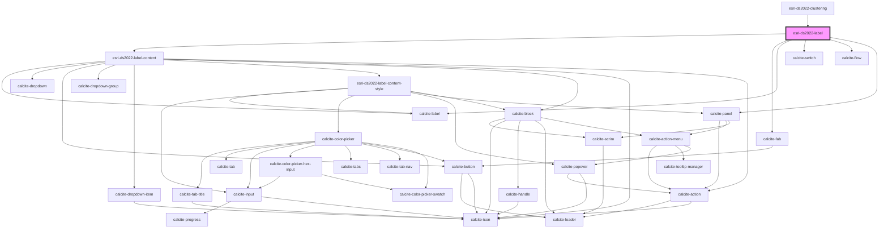

# esri-ds2022-label

<!-- Auto Generated Below -->

## Properties

| Property  | Attribute | Description                                                                                                                  | Type           | Default     |
| --------- | --------- | ---------------------------------------------------------------------------------------------------------------------------- | -------------- | ----------- |
| `layer`   | --        | arcgis/core/layers/FeatureLayer: https://developers.arcgis.com/javascript/latest/api-reference/esri-layers-FeatureLayer.html | `FeatureLayer` | `undefined` |
| `mapView` | --        | arcgis/core/views/MapView: https://developers.arcgis.com/javascript/latest/api-reference/esri-views-MapView.html             | `MapView`      | `undefined` |

## Events

| Event          | Description                          | Type               |
| -------------- | ------------------------------------ | ------------------ |
| `labelUpdated` | Emitted when label has been updated. | `CustomEvent<any>` |

## Dependencies

### Used by

 - [esri-ds2022-clustering](../clustering)

### Depends on

- esri-ds2022-label-content
- calcite-fab
- calcite-label
- calcite-switch
- calcite-flow
- calcite-panel

### Graph

----------------------------------------------

*Built with [StencilJS](https://stenciljs.com/)*
