# esri-ds2022-map

<!-- Auto Generated Below -->

## Properties

| Property   | Attribute   | Description | Type     | Default                            |
| ---------- | ----------- | ----------- | -------- | ---------------------------------- |
| `mapTitle` | `map-title` |             | `string` | `"Geospatial web components demo"` |

## Dependencies

### Depends on

- calcite-shell
- calcite-shell-panel
- calcite-action-bar
- calcite-action
- [esri-ds2022-clustering](../clustering)

### Graph

```mermaid
graph TD;
  esri-ds2022-map-viewer --> calcite-shell
  esri-ds2022-map-viewer --> calcite-shell-panel
  esri-ds2022-map-viewer --> calcite-action-bar
  esri-ds2022-map-viewer --> calcite-action
  esri-ds2022-map-viewer --> esri-ds2022-clustering
  calcite-action-bar --> calcite-action-group
  calcite-action-group --> calcite-action-menu
  calcite-action-group --> calcite-action
  calcite-action-menu --> calcite-action
  calcite-action-menu --> calcite-tooltip-manager
  calcite-action-menu --> calcite-popover
  calcite-action --> calcite-loader
  calcite-action --> calcite-icon
  calcite-popover --> calcite-action
  calcite-popover --> calcite-icon
  esri-ds2022-clustering --> calcite-label
  esri-ds2022-clustering --> calcite-switch
  esri-ds2022-clustering --> calcite-slider
  esri-ds2022-clustering --> calcite-button
  esri-ds2022-clustering --> calcite-flow
  esri-ds2022-clustering --> calcite-panel
  esri-ds2022-clustering --> esri-ds2022-label
  calcite-slider --> calcite-graph
  calcite-button --> calcite-loader
  calcite-button --> calcite-icon
  calcite-panel --> calcite-action
  calcite-panel --> calcite-action-menu
  calcite-panel --> calcite-scrim
  calcite-scrim --> calcite-loader
  esri-ds2022-label --> esri-ds2022-label-content
  esri-ds2022-label --> calcite-fab
  esri-ds2022-label --> calcite-label
  esri-ds2022-label --> calcite-switch
  esri-ds2022-label --> calcite-flow
  esri-ds2022-label --> calcite-panel
  esri-ds2022-label-content --> calcite-label
  esri-ds2022-label-content --> calcite-dropdown
  esri-ds2022-label-content --> calcite-button
  esri-ds2022-label-content --> calcite-dropdown-group
  esri-ds2022-label-content --> calcite-dropdown-item
  esri-ds2022-label-content --> esri-ds2022-label-content-style
  esri-ds2022-label-content --> calcite-block
  esri-ds2022-label-content --> calcite-icon
  esri-ds2022-label-content --> calcite-action
  calcite-dropdown-item --> calcite-icon
  esri-ds2022-label-content-style --> calcite-label
  esri-ds2022-label-content-style --> calcite-input
  esri-ds2022-label-content-style --> calcite-color-picker
  esri-ds2022-label-content-style --> calcite-popover
  esri-ds2022-label-content-style --> calcite-panel
  esri-ds2022-label-content-style --> calcite-block
  calcite-input --> calcite-progress
  calcite-input --> calcite-icon
  calcite-color-picker --> calcite-tab-title
  calcite-color-picker --> calcite-tab
  calcite-color-picker --> calcite-input
  calcite-color-picker --> calcite-color-picker-hex-input
  calcite-color-picker --> calcite-tabs
  calcite-color-picker --> calcite-tab-nav
  calcite-color-picker --> calcite-button
  calcite-color-picker --> calcite-color-picker-swatch
  calcite-tab-title --> calcite-icon
  calcite-color-picker-hex-input --> calcite-input
  calcite-color-picker-hex-input --> calcite-color-picker-swatch
  calcite-block --> calcite-scrim
  calcite-block --> calcite-icon
  calcite-block --> calcite-handle
  calcite-block --> calcite-loader
  calcite-block --> calcite-action-menu
  calcite-handle --> calcite-icon
  calcite-fab --> calcite-button
  style esri-ds2022-map-viewer fill:#f9f,stroke:#333,stroke-width:4px
```

----------------------------------------------

*Built with [StencilJS](https://stenciljs.com/)*
