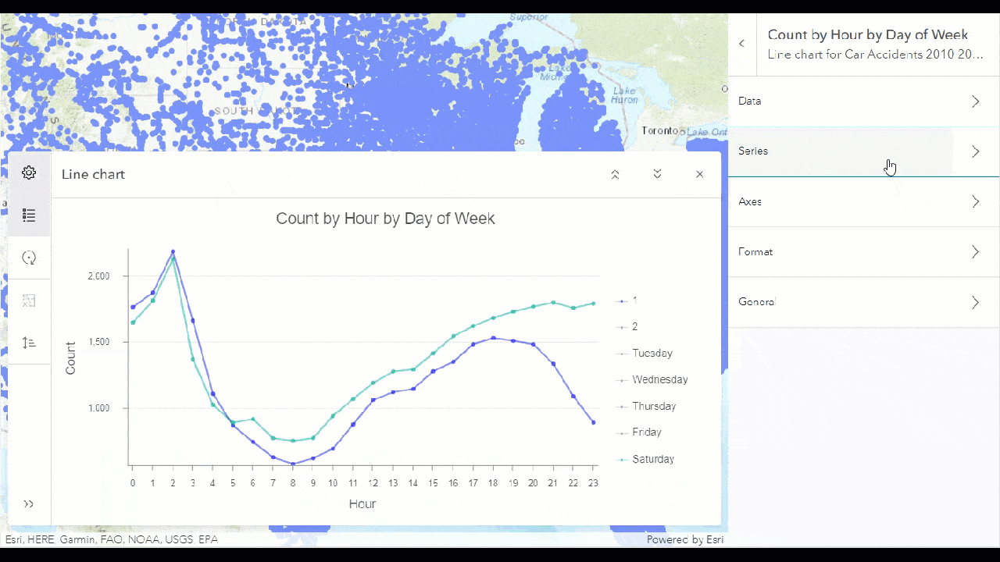
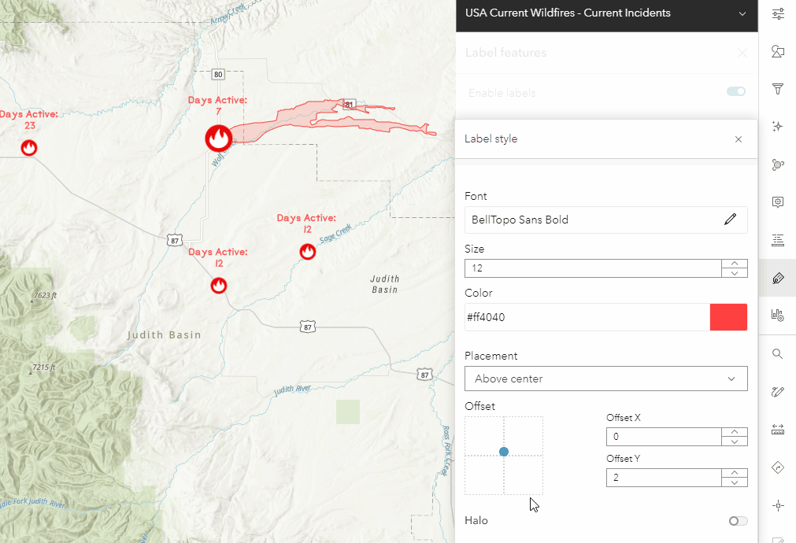
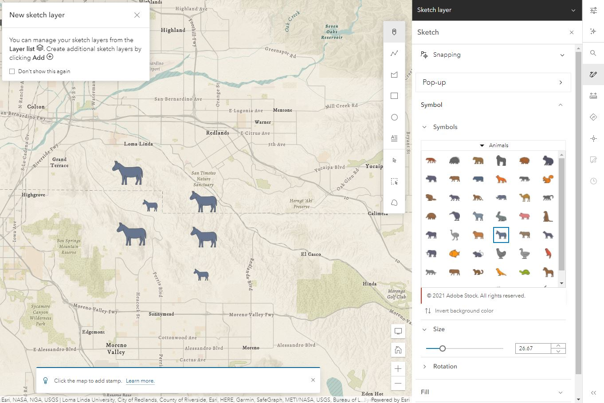
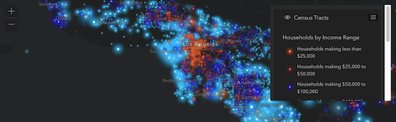
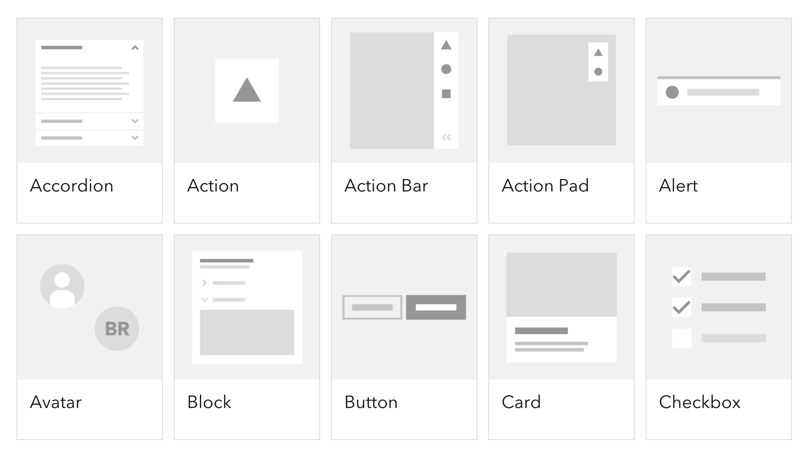
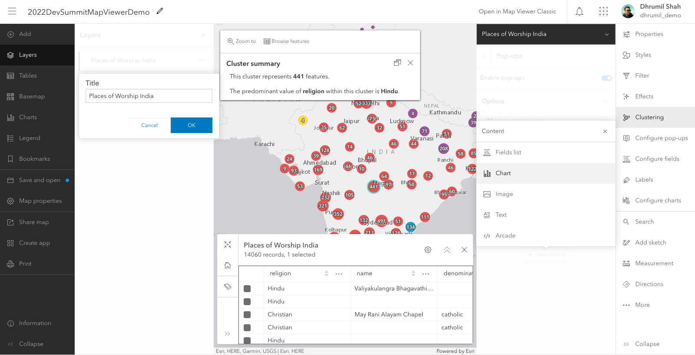
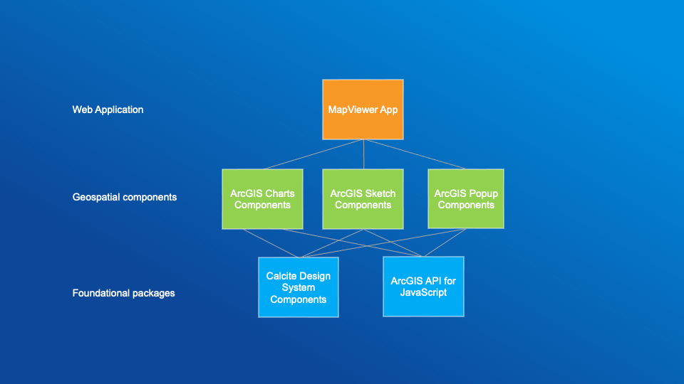
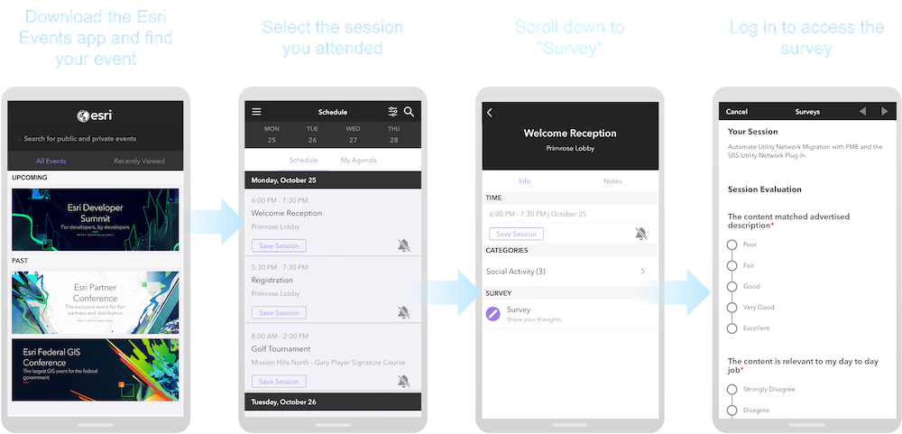

<!-- .slide: data-background="img/2022/dev-summit/bg-1.png" data-background-size="cover" -->

<h1 style="text-align: left; font-size: 80px;">Building Geospatial Web Components</h1>

<p style="display: flex; line-height: normal; gap: 14px; color: var(--r-section-subhead-color);"><calcite-avatar scale="l" full-name="Dhrumil Shah" thumbnail="./img/dhrumil.jpeg"></calcite-avatar>Dhrumil Shah<calcite-avatar style="margin-left: 14px" scale="l" full-name="Matt Driscoll" thumbnail="./img/matt.jpeg"></calcite-avatar>Matt Driscoll </p>

<p style="text-align: left; font-size: 30px;">Slides + Demos: <a href="https://esriurl.com/ds2022-geo-web-components"><code>esriurl.com/ds2022-geo-web-components</code></a></p>

---

# Agenda

- Geospatial Components <!-- Matt -->
  - Background <!-- Matt -->
  - Composition <!-- Matt -->
  - Architecture <!-- Matt -->
- Application Architecture <!-- Dhrumil -->
- Demo: Esri apps using geospatial components <!-- Dhrumil -->
- Patterns & Practices <!-- Dhrumil -->
- Demo: Sample app using geospatial components <!-- Dhrumil & Matt -->

---

<!-- .slide: data-background="img/2022/dev-summit/bg-7.png" data-background-size="cover" -->

# Geospatial Components

## What are they?

- Higher level componnets
- GIS workflow (JSAPI)

---


# Geospatial Components

<div class="grid">
  <label>Charts</label>
  <label>Label</label>
</div>

---

# Geospatial Components

<div class="grid">
  <label>Effects</label>
  <label>Sketch</label>
</div>

---

# Background

- New Map Viewer Development (2018/2019)
  - Major browsers started supporting web components
  - Calcite design system
- Need for components
  - Re-use entire workflows in the new map viewer and other applications
  - Framework agnostic

---

# Composition

- Composed of
  - ArcGIS JS API
  - Calcite Design System
    - Components
- Built as a web component

---

<!-- .slide: data-background="img/2022/dev-summit/bg-7.png" data-background-size="cover" -->

# ArcGIS API for JavaScript

[](https://developers.arcgis.com/javascript/latest/)

Modern (ES Modules: Native module format)

```js
import Map from "@arcgis/core/Map";
import MapView from "@arcgis/core/views/MapView";
```

Legacy ([esri-loader](https://github.com/Esri/esri-loader))

```js
import { loadModules } from "esri-loader";
loadModules(["esri/core/Map", "esri/views/MapView"]); // AMD Format
```

---

<!-- .slide: data-background="img/2022/dev-summit/bg-7.png" data-background-size="cover" -->

# Calcite

Esri's design system


---

# Calcite Design System

- Visual language for products
  - [Design guidelines](https://developers.arcgis.com/calcite-design-system/foundations/colors/)
    - Color, Spacing, Typography...
  - Graphic resources (Icons, symbols, Figma UI Kit)
  - Interactive documentation
    - Patterns & best practices
  - Reusable components

---

# Calcite Components

- Web Components for Calcite Design System
  - 50+ web components
    - Provides a library of patterns
  - Internal & external use
  - Easily build beautiful consistent apps

---

# Componenent Documentation

[](https://developers.arcgis.com/calcite-design-system/components/)

---

# Calcite Benefits <calcite-icon scale="l" icon="thumbs-up"></calcite-icon>

- Consistent UX
- Efficiency
  - Apps follow agreed upon designs workflows
  - Speed up development timelines
- Standards-based web components
  - W3C specification (future-proof)
  - Encapsulation (Shadow DOM)
  - Framework agnostic (Can be used in any framework)
- Accessibility (W3 Guidelines)

---

<!-- .slide: data-background="img/2022/dev-summit/bg-7.png" data-background-size="cover" -->

# Web Components


---

# About Web Components

- Suite of different technologies (web standards)
- Allows you to create reusable custom elements
  - `<my-custom-element>`
  - Functionality encapsulated
- Supported by modern browsers

---

# Technology

- Custom elements
  - Browser-compatible elements
  - Work just like other elements
- Shadow DOM
  - Encapsulates component HTML & CSS
  - Isolated DOM
  - `<slot>` tag for placeholder content
- HTML templating & slotting
  - `slot` attribute

---

# Configuring Web Components

## Properties, Attributes, Methods

HTML

```html
<my-component my-prop="myValue" my-boolean-prop></my-component>
```

JavaScript

```js
const myComponent = document.querySelector("my-component");
myComponent.myProp = "myValue";
myComponent.myBooleanProp = true;
myComponent.myMethod();
```

---

# Configuring Web Components

## Slots

Allows end user to place content within a component

---

# Default Component Slot

For default content placement

```html
<calcite-split-button scale="l" primary-text="My Button!">
  <calcite-dropdown-group>
    <calcite-dropdown-item>Option 1</calcite-dropdown-item>
    <calcite-dropdown-item>Option 2</calcite-dropdown-item>
    <calcite-dropdown-item>Option 3</calcite-dropdown-item>
  </calcite-dropdown-group>
</calcite-split-button>
```

<calcite-split-button style="text-align: left" scale="l" primary-text="My Button!">
  <calcite-dropdown-group>
    <calcite-dropdown-item>Option 1</calcite-dropdown-item>
    <calcite-dropdown-item>Option 2</calcite-dropdown-item>
    <calcite-dropdown-item>Option 3</calcite-dropdown-item>
  </calcite-dropdown-group>
</calcite-split-button>

---

# Named Component Slots

To customize certain regions

```html
<calcite-card>
  <h3 slot="title">Esri</h3>
  
  <span slot="subtitle">
    Esri is an international supplier of geographic information system
    software...
  </span>
</calcite-card>
```

<iframe width="310" height="310" data-src="snippets/card.html" data-preload scrolling="no"></iframe>

---

# Basic Web Component

```js
class MyComponent extends HTMLElement {
  connectedCallback() {
    let shadow = this.attachShadow({ mode: "open" });
    shadow.innerHTML = `<h2>Hello DevSummit!</h2>`;
  }
}

customElements.define("my-component", MyComponent);
```

```html
<my-component></my-component>
```

<my-component></my-component>

---

<!-- .slide: data-background="img/2022/dev-summit/bg-7.png" data-background-size="cover" -->

# Component Architecture

---

# Stencil.js

[](https://stenciljs.com/)

- Toolchain for building Design Systems
- Built by [Ionic framework](https://ionicframework.com/) team
- Typescript & JSX
- Compiles Web Components
- [Getting Started](https://stenciljs.com/docs/getting-started)
- Alternatives
  - [Lit](https://lit.dev/)
  - Frameworks => web components

---

# Basic Stencil.js Component

```jsx
import { Component, Prop, h } from "@stencil/core";

@Component({
  tag: "my-first-component",
  shadow: true
})
export class MyComponent {
  // Name should be a public property on component
  @Prop() name: string;

  render() {
    return <p>My name is {this.name}</p>;
  }
}
```

---

# Basic Component HTML Markup

```html
<my-first-component name="Matt"></my-first-component>
```

When rendered, the browser will display

`My name is Matt`

---

# Application Architecture

---

# Map viewer



---

# Map viewer Architecture

<!-- todo image -->



---

# Host application

It provides the application shell which is built using the calcite components based on the ArcGIS API for JavaScript Widget framework

---

# Micro frontend

Map Viewer is built as a micro frontend based application as a composition of features developed as web components by different teams.

---

# Example Geospatial Components

Geospatial web components/Micro-Frontends used in Map Viewer

- Pop-up
- Chart
- Effect
- Table
- Label
- Clustering
- ...etc

---

# Demo: Esri apps using geospatial components

<!--
  - Map viewer
- Scene viewer
  - Charts MV
  - Charts Instant apps
- arcgis.com
-->

---

# Micro frontend Benefits

- Break up monolith applications
  - Self-contained and independent from the host application
- Smaller, cohesive and better maintainable codebases
  - Different teams can develop, test and deploy independent features from start to end on themselves.
  - Development and deployments become faster
  - Easier for new developers to get started
- Reusable across different applications/frameworks

---

# Geospatial components patterns & practices

- Micro frontend composition in the browser
  - Using Web Components provides us a client-side composition approach
- Shared Design System
  - To provide consistent look and feel across all frontend components
- "Props Down, Events Up" communication pattern
  - Pass different required properties
- Components get the application state via Props

---

# Demo: Sample app using geospatial components

---

# Please Share Your Feedback in the App​



---

<!-- .slide: data-background="img/2022/dev-summit/bg-7.png" data-background-size="cover" -->

# Questions? 🤔

<p>Slides + Demos: <a href="https://esriurl.com/ds2022-geo-web-components"><code>esriurl.com/ds2022-geo-web-components</code></a></p>

---

<!-- .slide: data-background="img/2022/dev-summit/bg-8.png" data-background-size="cover" -->
