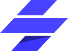

<!-- .slide: data-background="img/2022/dev-summit/bg-1.png" data-background-size="cover" -->

<h1 style="text-align: left; font-size: 80px;">Building Geospatial Web Components</h1>

<p style="display: flex; line-height: normal; gap: 14px; color: var(--r-section-subhead-color);"><calcite-avatar scale="l" full-name="Dhrumil Shah" thumbnail="./img/dhrumil.jpeg"></calcite-avatar>Dhrumil Shah<calcite-avatar style="margin-left: 14px" scale="l" full-name="Matt Driscoll" thumbnail="./img/matt.jpeg"></calcite-avatar>Matt Driscoll </p>

<p style="text-align: left; font-size: 30px;">Slides: <a href="https://esriurl.com/ds2022-geo-web-components"><code>esriurl.com/ds2022-geo-web-components</code></a></p>

---

# Agenda

- Calcite Design System <!-- Matt -->
- Web components <!-- Matt -->
- Geospatial components <!-- Matt: Intro/background: how this got started. -->
- Demo: Esri web apps using geospatial components
- Geospatial components patterns & practices <!-- Here we talk about patterns, best practices, jsapi intergration, etc -->
- Demo: Sample app using geospatial components

---

<!-- .slide: data-background="img/2022/dev-summit/bg-7.png" data-background-size="cover" -->

# Calcite: Esri's design system

- Visual language for products
  - Design guidelines
    - Color, Spacing, Typography...
  - Graphic resources (Icons, symbols, Figma UI Kit)
  - Interactive documentation
    - Patterns & best practices
  - Reusable components
- Closes the gap between designers and UI engineers

---

# Calcite components

- Web Components for Calcite Design System
  - 50+ web components
    - Ready to use
    - Reusable
    - Provides a library of patterns
  - Internal & external use
    - [Developer subscription](https://developers.arcgis.com/pricing/build-arcgis-solutions/)
  - Easily build beautiful consistent apps

---

# Benefits

Benefits of Calcite

---

# Consistency <calcite-icon icon="thumbs-up"></calcite-icon>

- Consistent UX
  - Esri identity (look & feel)
  - Best practices
  - Conventions
- Clear direction for designers & developers

---

# Efficiency <calcite-icon icon="thumbs-up"></calcite-icon>

- Reduced effort & cost
  - Apps follow agreed upon designs workflows
  - Reduce cost of design updates
  - Reusable (Stop reinventing the wheel)
- Speed up development timelines
  - Build Compelling Web Apps Faster

---

# Accessibility <calcite-icon icon="thumbs-up"></calcite-icon>

- Follows [WCAG](https://www.w3.org/WAI/standards-guidelines/wcag/) (W3 a11y guidelines)
  - Semantics
  - Keyboard access
  - Color contrast
  - Text alternatives
- Continuous Integration testing using [deque axe API](https://www.deque.com/)

---

# Standards-based <calcite-icon icon="thumbs-up"></calcite-icon>

- Web components
  - W3C specification (future-proof)
  - Encapsulation (Shadow DOM)
  - Familiarity (HTML)
  - Framework agnostic (Can be used in any framework)

---

<!-- .slide: data-background="img/2022/dev-summit/bg-7.png" data-background-size="cover" -->

# About Web Components

- Suite of different technologies (web standards)
- Allows you to create reusable custom elements
  - Functionality encapsulated
  - Utilize them in your web apps
- Supported by modern browsers

---

# Web Components Tech

- Custom elements
  - Browser-compatible elements
  - Use native APIs
  - DOM element lifecycle
- HTML templates & slotting
- `<template>` and `<slot>` elements
- Shadow DOM
  - Encapsulates component HTML & CSS
  - `<slot>` tag for distributing content

---

# Configuring Web Components

Primary ways to configure a web component

- Properties/Attributes
- Slots

---

# Named Slots

To customize certain regions

```html
<calcite-card>
  <h3 slot="title">Nicolas Cage</h3>
  
  <span slot="subtitle"
    >Nicolas Kim Coppola, known professionally as Nicolas Cage, is an American
    actor and filmmaker.</span
  >
</calcite-card>
```

<iframe width="310" height="310" data-src="snippets/card.html" data-preload scrolling="no"></iframe>

---

# Default Slots

For default content placement

```html
<calcite-split-button primary-text="My Button!">
  <calcite-dropdown-group>
    <calcite-dropdown-item>Option 1</calcite-dropdown-item>
    <calcite-dropdown-item>Option 2</calcite-dropdown-item>
    <calcite-dropdown-item>Option 3</calcite-dropdown-item>
  </calcite-dropdown-group>
</calcite-split-button>
```

<calcite-split-button primary-text="My Button!">
  <calcite-dropdown-group>
    <calcite-dropdown-item>Option 1</calcite-dropdown-item>
    <calcite-dropdown-item>Option 2</calcite-dropdown-item>
    <calcite-dropdown-item>Option 3</calcite-dropdown-item>
  </calcite-dropdown-group>
</calcite-split-button>

---

# Basic Web Component

```js
class MyComponent extends HTMLElement {
  connectedCallback() {
    this.innerHTML = `<h1>Hello world</h1>`;
  }
}

customElements.define("my-component", MyComponent);
```

---

<!-- .slide: data-background="img/2022/dev-summit/bg-7.png" data-background-size="cover" -->

# Building Web Components

How we're building web components

---

# Stencil.js

[](https://stenciljs.com/)

- Toolchain for building Design Systems
- Ionic Framework team
- Compiles Web Components
- Virtual DOM, Typescript and JSX
- [Getting Started](https://stenciljs.com/docs/getting-started)

---

# Basic Component Class

```jsx
import { Component, Prop, h } from "@stencil/core";

@Component({
  tag: "my-first-component",
})
export class MyComponent {
  // Name should be a public property on component
  @Prop() name: string;

  render() {
    return <p>My name is {this.name}</p>;
  }
}
```

---

# Basic Component HTML Markup

```html
<my-first-component name="Matt"></my-first-component>
```

When rendered, the browser will display "My name is Matt"

---

# Geospatial Components

- Map Viewer(2019)
  - Major browsers started supporting web components
  - Calcite design system
- Re-use entire workflows in the new map viewer and other applications
- Framework agnostic

---

# Geospatial Components Composition

- Composed of
  - ArcGIS JS API
  - Calcite Design System components
- Built as a web component
  - Stencil.js

---

# Map viewer setup

- Host application
  - Maquette.js
- Geospatial web components/Micro-Frontends
  - Popup configurator
  - Effects
  - Sketch
  - Charts
  - etc...

---

# Demo: Esri web apps using geospatial components

---

# Geospatial components patterns & practices

---

# Demo: Sample app using geospatial components

TODO

---

<!-- .slide: data-background="img/2022/dev-summit/bg-7.png" data-background-size="cover" -->

# Questions? 🤔

---

<!-- .slide: data-background="img/2022/dev-summit/bg-7.png" data-background-size="cover" -->

Please provide your feedback for this session by clicking on the session survey link directly below the video.

<!-- .element: style="margin: 0 20%;" -->

---

<!-- .slide: data-background="img/2022/dev-summit/bg-8.png" data-background-size="cover" -->

---

<h1 style="text-align: left; font-size: 48px;">Section Header</h1>
<p style="text-align: left; font-size: 24px; color: var(--r-section-subhead-color);">Section Subhead</p>

---

<h2 data-id="code-title">Code Example</h2>
<pre data-id="code-animation"><code class="hljs" data-trim data-line-numbers>
import React, { useState } from 'react';

function Example() {
const [count, setCount] = useState(0);
return (
...
);
}
</code></pre>
